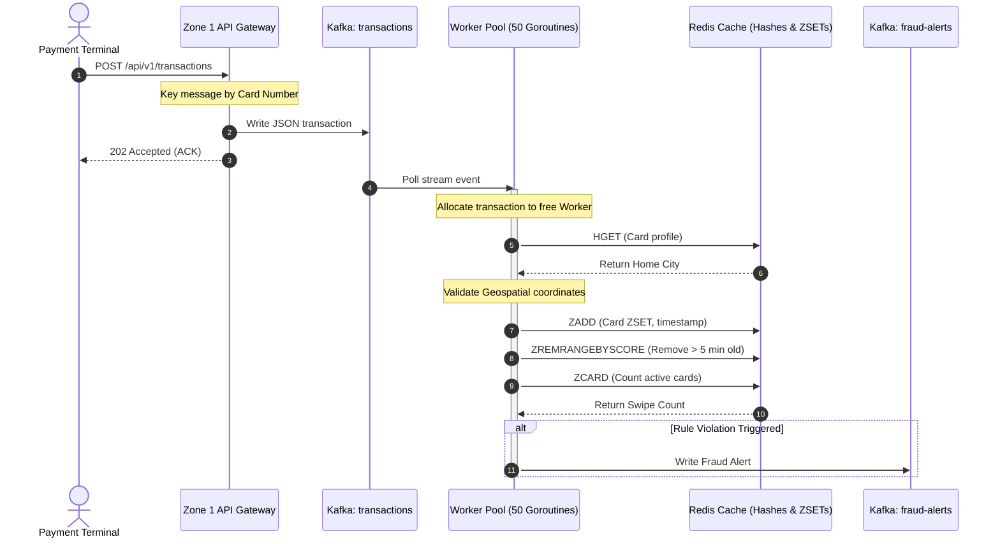
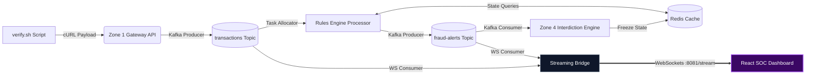

# Real-Time Financial Fraud Detection & Interdiction Pipeline

[](https://opensource.org/licenses/MIT)
[](https://go.dev)
[](https://react.dev)
[](https://kafka.apache.org)
[](https://redis.io)

This repository implements a high-throughput, low-latency, event-driven architecture designed to ingest, process, evaluate, and mitigate financial fraud in-flight. Leveraging a "Data-in-Motion" paradigm, the system intercepts card transactions, performs multi-dimensional rule analysis (velocity limits and geospatial anomalies) in sub-millisecond windows, and executes active security interdictions.

---

## 🏛️ Architectural Inspiration

The structural boundaries and decoupled, event-driven pattern utilized in this project are heavily inspired by **Tazama**, the open-source Real-Time Transaction Monitoring System managed under the auspices of the **Linux Foundation**. 

For a comprehensive review of Tazama’s architectural patterns and reference implementations, consult the [Tazama Documentation Repository](https://github.com/tazama-lf/docs).

---

## ⚠️ The Problem Statement

### The Failure of "Data at Rest"
Traditional relational database management systems (RDBMS) process transactions using a store-then-analyze pattern ("Data at Rest"). Under this model:
1. A transaction is processed and authorized.
2. The transaction is written to disk.
3. Batch analytical scripts or scheduled ETL runs scan the tables minutes, hours, or days later.

By the time a violation is flagged, the capital has already cleared the institution, making recovery difficult.

### The "Data in Motion" Requirement
Modern digital banking demands that fraud evaluation happen **in-flight** (pre-authorization) within a sub-millisecond SLA. The system must process transactions as continuous streams of events. 

Evaluating stateful context across these events is a significant challenge. For example:
- **The Geospatial Anomaly**: Catching a card swiped in *New York, NY* and then in *London, UK* just 2 minutes later.
- **The Velocity Breach**: Monitoring if a single card is swiped more than 3 times within a rolling 5-minute window.

To resolve this without introducing latency, processing must be shifted to high-concurrency memory spaces and decoupled messaging brokers.

---

## 🛠️ The Technology Stack

### Apache Kafka (Event Backbone)
Unlike traditional message queues (e.g., RabbitMQ) that delete messages once consumed, Kafka acts as an immutable, distributed append-only commit log. 
- **Non-destructive Reads**: Multiple downstream consumers (the Rule Processor, the Interdiction Engine, and the Streaming Bridge) can read the exact same transaction stream simultaneously without interfering with one another.
- **Partition Ordering**: Ingested transactions are keyed by their `card_number` to guarantee that all transactions for a specific card route to the same partition, preserving strict chronological ordering.

### Redis (Ultra-Fast State Tracking)
To support sub-millisecond evaluation, state checks avoid disk lookups entirely:
- **Redis Hashes**: Static profile registries (e.g., card status, home city) are cached inside hash tables for $O(1)$ lookups.
- **Redis Sorted Sets (ZSET)**: Used to manually calculate rolling time-window sliding metrics. Transaction timestamps are ingested as sorted set scores. The system executes atomic pipelines:
  1. `ZADD` to register the new swipe.
  2. `ZREMRANGEBYSCORE` to eject all swipes older than the 5-minute threshold.
  3. `ZCARD` to count the remaining active card swipes.

### Go (Golang - Engine Layer)
Go is utilized for the gateway, rule processors, interdiction engine, and websocket bridge. It offers near-C performance, a minimal memory footprint, and native concurrency primitives (Goroutines and channels). This allows the system to spin up hundreds of concurrent workers to process thousands of transactions per second without experiencing garbage collection locks or system backpressure.

### React + Tailwind CSS (SOC Command Center)
The dashboard is built on Vite + React + TypeScript + Framer Motion. It acts as a Security Operations Center (SOC) visualizer, connecting directly to the Go Streaming Bridge via WebSockets to render metrics, thread telemetry, and interdiction milestones in real time.

---

## ⚡ System Flow: The 4 Zones

The pipeline is split into four decoupled zones to ensure fault isolation:

```
[Zone 1: Ingestion API] 
         │ (Keyed by Card Number)
         ▼
[Kafka: "transactions" topic]
         │
         ▼
[Zone 2 & 3: Bounded Rule Processors] <──> [Redis: Hashes & Sorted Sets]
         │ (If Breach Detected)
         ▼
[Kafka: "fraud-alerts" topic]
         │
         ▼
[Zone 4: Interdiction Engine] ───────> [Redis: Freeze Card Status]
```

### Zone 1: Ingestion Gateway
A REST API (`main.go`) that receives transaction payloads from payment endpoints. It parses, validates, and serializes the transaction, publishing it to the Kafka `transactions` topic. It uses `card_number` as the routing key to ensure strict partition sequencing.

### Zone 2 & 3: Bounded Worker Pool & Rules Engine
The Processor (`processor/`) instantiates a thread-safe task channel and spawns a pool of 50 persistent background Go workers. These workers concurrently:
1. Retrieve a transaction.
2. Query Redis to check for a home-city geospatial mismatch.
3. Execute `ZSET` sliding operations to check velocity constraints.
4. If a breach is found, publish a structured alert payload to the `fraud-alerts` topic.

### Zone 4: Interdiction Engine
A service (`interdiction/`) that consumes from the `fraud-alerts` topic. It triggers an out-of-band mitigation flow (simulating cellular SMS webhooks) and updates the card registry in Redis to a `frozen` state, preventing subsequent authorizations.

---

## 📊 System Diagrams

### 1. Backend Processing Architecture (Zones 1-3)


### 2. End-to-End System Integration Flow


---

## 🧪 Testing the Frontend (Isolated Mocking)

To verify the React SOC Dashboard animations, metrics, and side drawers without running the entire Kafka, Redis, and Go backend pipeline, we have included a mock server:

* **Location**: [`dashboard-bridge/mock_server.go`](file:///home/gautam-kanakaraj/Desktop/fraud-detection-pipeline/dashboard-bridge/mock_server.go)
* **Function**: It launches a local WebSocket server on port `:8081` at `/stream` that mirrors the payload protocol of the live bridge. It periodically broadcasts random standard transactions and generates mock multi-swipe velocity attacks to trigger the dashboard's interdiction alerts.

Run the mock environment with:
```bash
make run-mock-pipeline
```

---

## 🚀 Installation & Execution Guide

The system includes a [`Makefile`](file:///home/gautam-kanakaraj/Desktop/fraud-detection-pipeline/Makefile) that simplifies compiling, building, and running all modular components.

### Prerequisites
- **Go**: `v1.25.0` or higher
- **Node.js**: `v18` or higher (with npm)
- **Docker & Docker Compose**

### Step 1: Start Database & Messaging Infrastructure
Start the Kafka broker and Redis cache:
```bash
make infra-up
```

### Step 2: Seed Baseline User Profiles
Initialize the Redis key-value store with baseline profile coordinates (e.g., home cities):
```bash
make seed
```

### Step 3: Run the Services
You can run the full ecosystem in one of two configurations:

#### Configuration A: Full Live Kafka Pipeline
To launch the API Gateway, Bounded Rules Processor, Interdiction Engine, WebSocket Streaming Bridge, and the React Dashboard together, run:
```bash
make run-pipeline
```
*To run individual backend parts separately, use:*
- Gateway: `make run-gateway`
- Processor: `make run-processor`
- Interdiction: `make run-interdiction`
- Bridge: `make run-bridge`
- React UI: `make run-dashboard`

#### Configuration B: Mock WebSocket Testing
To verify the React frontend dashboard using simulated WebSocket event injections without running Go backend engines or Docker containers, run:
```bash
make run-mock-pipeline
```

### Step 4: Run Verification Tests (Live Mode Only)
In Live Mode, trigger a transaction burst to test the pipeline end-to-end:
```bash
./verify.sh
```

### Step 5: Clean Up
Stop Docker containers:
```bash
make infra-down
```
Or kill any lingering background processes bound to the project ports:
```bash
make kill-all
```
